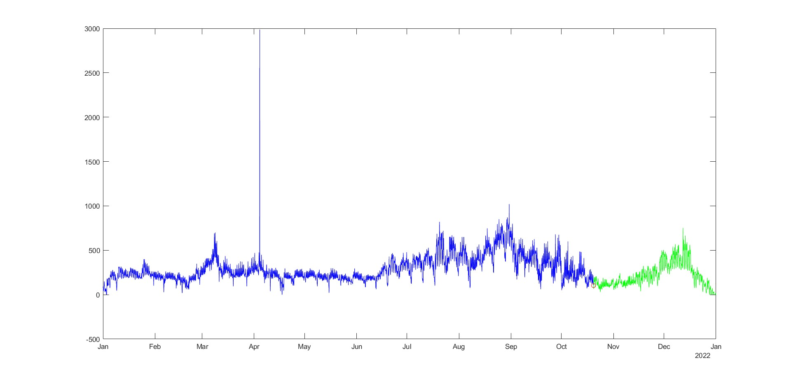

# Electrical Price Projection Model

**[Learning Project: Engineering Analysis and Design]**{https://github.com/Yashitasingh/electricity-price-forecasting/blob/main/Project_report_EAD.docx}

</img>

By using statistical analysis, this model forecasts temporal patterns that arise in electricity prices. Auto-Regressive Integrated Moving Average (ARIMA) is the statistical method employed. Model effeciency is evaluated using Mean Absolute Error (MAE) and Mean Squared Error (MSE).

The data was trained on France's Electricity Day Ahead Price (DAH) dataset, in MATLAB, and successfully predicted patterns for the proceeding 101.95 units of electricity.

This result holds significant implications for stakeholders in the electricity market, offering a reliable indicator of future pricing trends and facilitating informed decision-making in energy management, trading, and policy formulation.
